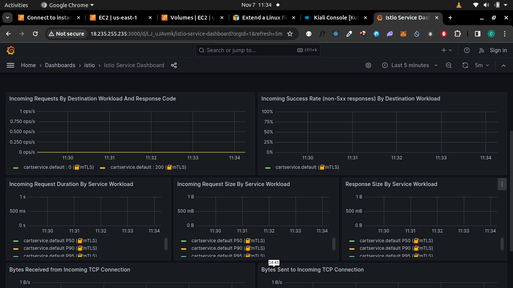
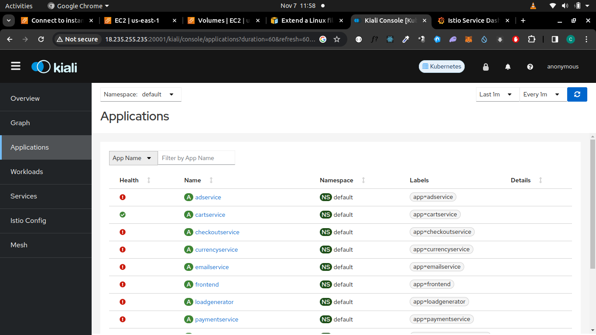
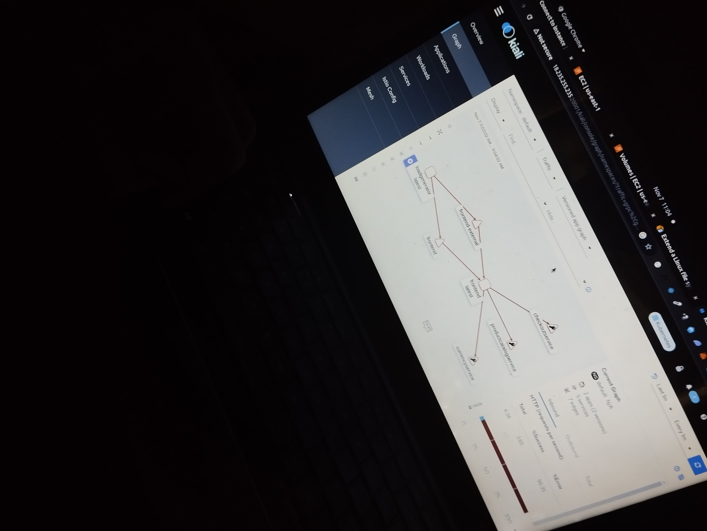

### Deployed Micro-Services Appliction into K8S Cluster and using Istio to get Telementary of each services.
###  Requirements 
Minikube 
6 CPUs and 8GB memory VM

####  Possible error has a result of not starting minikube
Error: failed to get the Kubernetes version: Get "https://192.168.49.2:8443/version?timeout=5s": dial tcp 192.168.49.2:8443: connect: no route to host

#### Resolve issue
-- Ensure to Grant permission to all users to use docker daemon  
`sudo chmod 777 /var/run/docker.sock`

### Start Minikube

`Minikube start --cpus 6 --memory 8000`

### Istio Installation
`curl -L https://istio.io/downloadIstio | sh -`

`cd istio-1.19.3`

Add the istioctl client to your path (Linux or macOS):

`export PATH=$PWD/bin:$PATH`

For this installation, we use the demo configuration profile. It’s selected to have a good set of defaults for testing, but there are other profiles for production or performance testing.

`istioctl install --set profile=demo -y`

verify test 
`istioctl verify-install`

Install some necesary addons/components needed for istio control-plane

`cd istio-1.19.3`  
`kubectl apply -f samples/addons`

verify the components/addons below are installed 

- **prometheus**: Collects and stores the
generated metrics as
time-series data
- **kiali**: A web console for
the mesh;
- **grafana**: Visualizes metrics
generated by the
proxies and collected
by Prometheus
- **Jaeger**: Distributed tracing system
to visualize request flow
through the mesh 

`kubectl get pods -n istio-system`

### Deploying Mircoservces into K8S Cluster

**switch from default namespace to istio-deployment namespace**
kubectl config set-context $(kubectl config current-context) --namespace=istio-deployment

**Clone the repo below***
`git clone https://github.com/Goddhi/App-Deployment-with-Istio.git`

**inject the Istio service proxy so that this service can participate in the service mesh**

`istioctl kube-inject -f Deployment/microservices-deployment.yml `

The istioctl kube-inject command takes a Kubernetes resource file and enriches
it with the sidecar deployment of the Istio service proxy and a few additional compo-
nents

To enable automatic injection, we label the istioinaction namespace with

`kubectl label namespace istio-deployment istio-inject=enabled`
**Deploy the Microservices Application**

`kubectl apply -f Deployment/miroservices-deployment.yml`

**Run kubectl get pods to  see pods**
`kubectl get pods`

observe under 'READY' it shows 2/2 it means to containers are running inside the pod the containers are:
the application container
the side-contianer (envoy service proxy)

Port-forward the emailservice deployment to view the the UI

`kubectl port-forward deploy/emailservice --address 0.0.0.0 8080:8080`

go to the browser and view the UI
`http://VM-public-ip:8080`

### Allowing External traffic into the cluster using istio ingress gateway to expose our webapp service###

`kubectl apply -f gateway.yml`

port forwarding  the istio-ingressgateway deployment

`kubectl port-forward deploy/istio-ingressgateway -n istio-system --address 0.0.0.0 8080:8080`

Verify if your gateway has a route

`istioctl proxy-config routes \
deploy/istio-ingressgateway.istio-system`

## Displaying Telementary of each services

### Istio observability features
### Grafana
### Kiali

port-forward grafana service

`kubectl port-forward svc/grafana --address 0.0.0.0 3000:3000 -n istio-system`

view the Grafana UI in the browser
`http://VM-public-ip:3000`

Metric Visualization of the Microservices Application 

port-forward kiali service

`kubectl port-forward svc/kiali --address 0.0.0.0 20001:20001 -n istio-system`

view the Kiali UI in the browser
`http://VM-public-ip:20001`

View of Microservices Application health status

Architectural Diagram of Th Micoservices

